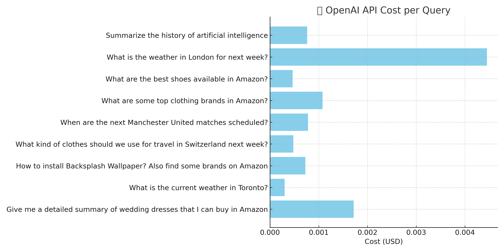

---

## 🧮 Component 2: Agent LLM Cost Analysis (`gpt-4o-mini`)

This project uses `get_openai_callback()` to track OpenAI API usage in real time.

**Measured Metrics:**
- Input tokens (prompt)
- Output tokens (completion)
- Total cost ($) per query

**Sample Run (n = 10 queries)**

| Metric | Value |
|--------|-------|
| Avg. Prompt Tokens | ~1,050 |
| Avg. Completion Tokens | ~270 |
| Max Completion Tokens | ~612 |
| Total Cost | ~$0.009 |

**Optimizations Applied:**
- Capped output via `max_tokens=2000`
- Chose `gpt-4o-mini` for 80% cost savings
- Queries analyzed from multiple domains

📁 See [`examples/cost_analysis_agent_llm.py`](../examples/cost_analysis_agent_llm.py)

Cost per query chart

Toens per query chart 
